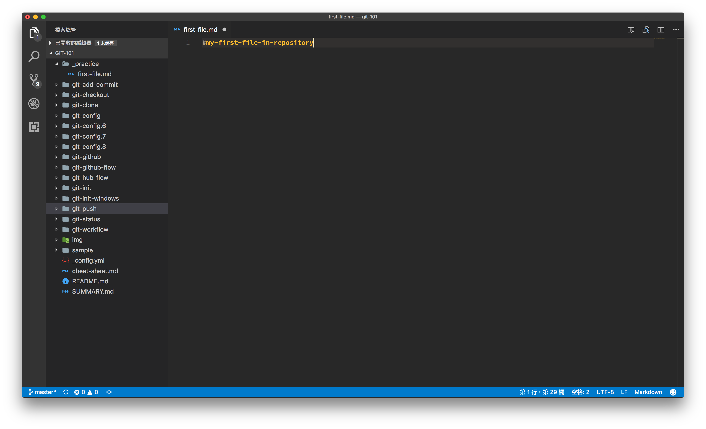
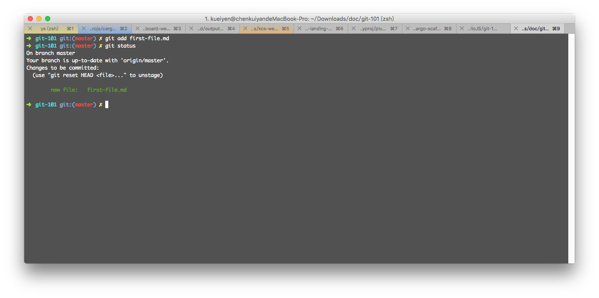
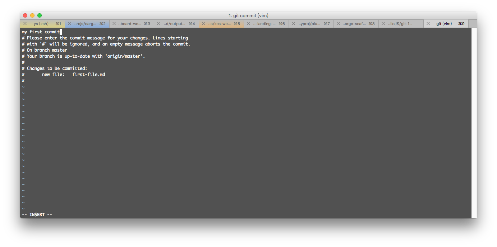
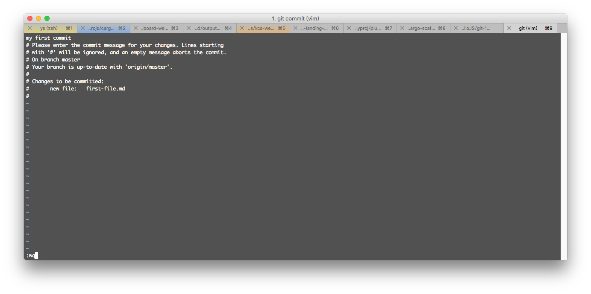

# git add/commit

## 目錄
- [回目錄](../SUMMARY.md)

***


## 新增檔案到 repository

1. 請使用 `VS Code` 開啟上一步驟所建立的 `git-101` 資料夾
2. 找到左側的 `_practie` 資料夾並且新增一個檔案 `first-file.md`
3. 然後輸入文字 `#my-first-file-in-repository`



## 使用 git status 檢視檔案狀態

回到終端機，__確保目前已經進入 `git-101` 資料夾後__，輸入以下指令並複製出現的檔案名稱。

```
git status
```


## 使用 git add 選擇要加入的檔案

輸入以下指令，選擇剛才新增的檔案 `first-file.md` 後再次使用 `git status` 觀察 git 儲存庫的狀態。

```
git add first-file.md
git status
```



### 進階用法

```
git add .
```

## 使用 git commit 提交變更

輸入以下指令，將上一步驟新增的檔案記錄提交到 git 進行變更。

```
git commit
```

執行後會出現黑色的編輯器視窗，然後：

- 按 `i` 鍵進行編輯
- 輸入 `my first commit`



- 按下 `esc` 按鍵
- 輸入 `:wq` 離開編輯器




#### 進階用法

避開使用編輯器撰寫 commit 訊息：

```
git commit -m "commit 訊息"
```

修改上一次的 commit 訊息：

```
git commit --amend
```

## 小結
- 熟悉 `git status` 使用
- 學會使用 `git add` 選擇想要新增到版控的檔案
- 學會使用 `git commit` 與 `git commit -m` 撰寫變更訊息

***

## 下一頁
- [回目錄](../SUMMARY.md)
- [git push](../git-push/index.md)