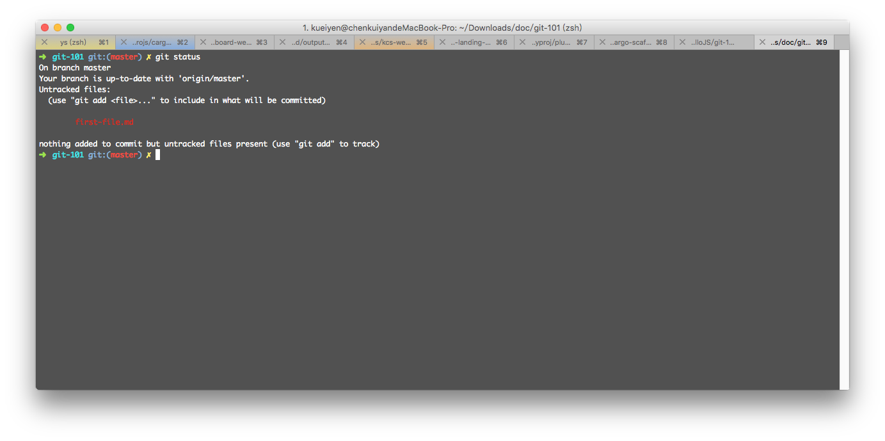

# git add/commit

## 目錄
- [回目錄](../SUMMARY.md)

***


## 新增檔案到 repository

請使用 `VS Code` 開啟上一步驟所建立的 `git-101` 資料夾，並且新增一個檔案 `first-file.md`，然後輸入文字 `#my-first-file-in-repository`。

## 使用 git status 檢視檔案狀態

回到終端機，__確保目前已經進入 `git-101` 資料夾後__，輸入以下指令並複製出現的檔案名稱。

```
git status
```



## 使用 git add 選擇要加入的檔案

***

## 下一頁
- [回目錄](../SUMMARY.md)
- [git push](../git-push/index.md)