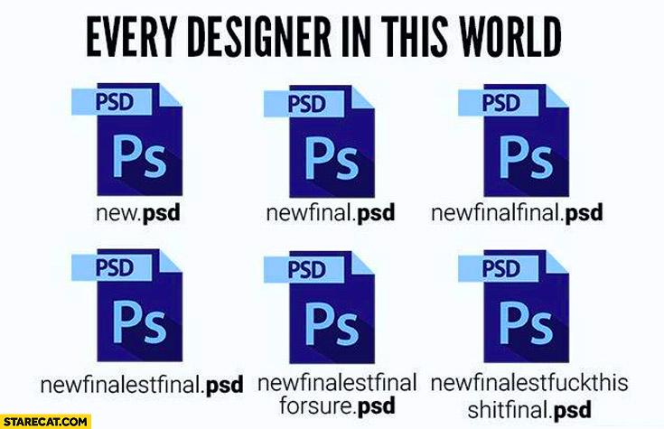
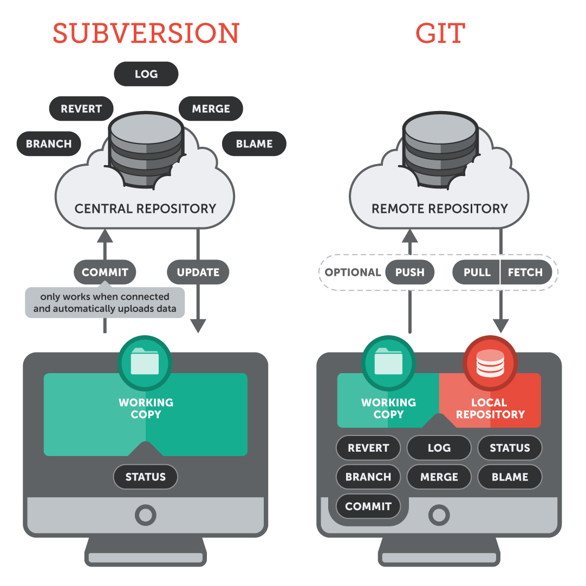
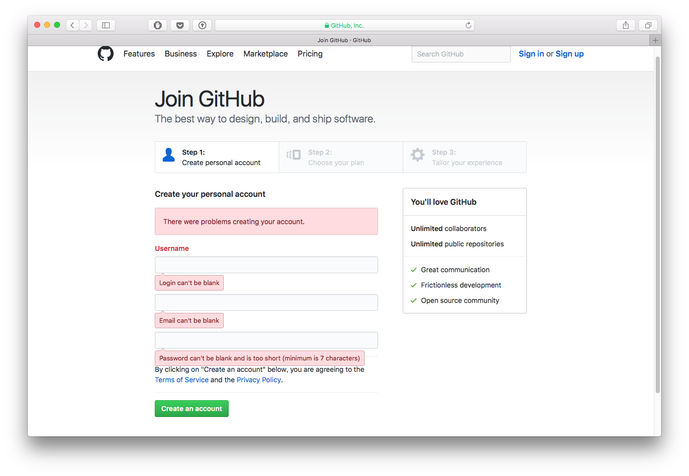
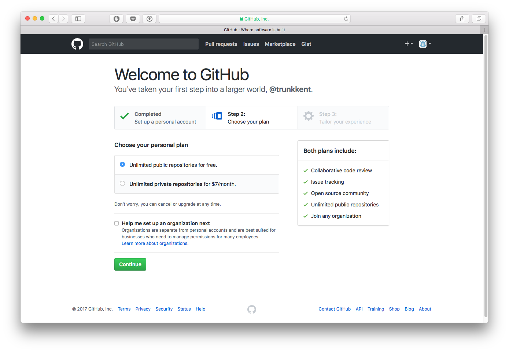
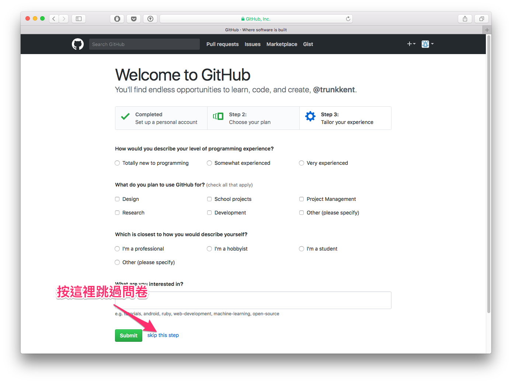
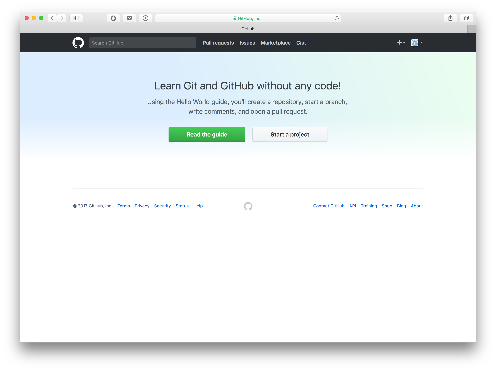

# git 與 Github

## 目錄
- [回目錄](../SUMMARY.md)

***

## git 


### 簡介
- Since 2005
- 由 Linus Torvalds（Linux之父）開發
- 免費/開源
- GUI 選擇眾多
  - SourceTree for Mac/Windows（建議使用）
- git 官方網站：[https://git-scm.com/](https://git-scm.com/)

### 為什麼要使用版控



- 對一個資料夾下的所有檔案做備份管理
- 將檔案的Snapshot(快照)保存到歷史紀錄
- 為每次檔案更動留下說明
- 將檔案復原到某個歷史紀錄
- 顯示不同記錄版本的檔案差異
- 與他人協同合作
- ~~找戰犯~~

### 版本控制系統差異

版本控制系統（Version Control System）簡稱VCS；具體有兩種實現模式：集中式與分散式。

兩者最大的差異在於：__是否在本地端（local 端）具有儲存庫__。



```
取自 https://www.git-tower.com/blog/switching-from-subversion-to-git/
```

***

## Github

### 簡介


- __`不等同 git`__
- Github：[https://github.com/](https://github.com/)
- 是一個提供 git 技術的雲端原始碼託管平台
- ~~全球最大男性交友平台~~
- 有自己的 git GUI 工具：[https://desktop.github.com/](https://desktop.github.com/)
- 同類型網站
  - Gitlab：[https://about.gitlab.com/](https://about.gitlab.com/)
  - Bitbucket：[https://bitbucket.org/](https://bitbucket.org/)
  - Gogs：[https://gogs.io/](https://gogs.io/)

### Github 帳號申請

連到 [https://github.com/join](https://github.com/join) 按照畫面上輸入想要申請的帳號與密碼，然後點擊 `create an account`。



稍後會出現如下畫面，選擇第一個項目以使用免費帳號；下方的 checkbox 提示是否需要建立 Github Org，不要勾選。



最後會出現問卷，直接點選箭頭處可以跳過。



看到如下畫面時，即表示帳號註冊完成。



## 下一頁
- [回目錄](../SUMMARY.md)
- [儲存庫（git repository）](../git-repository/index.md)