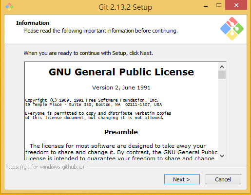
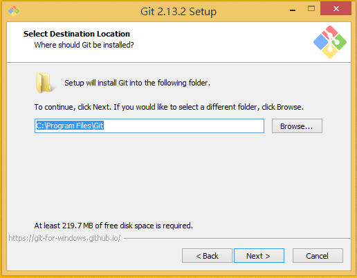
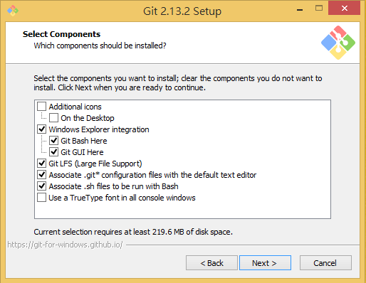
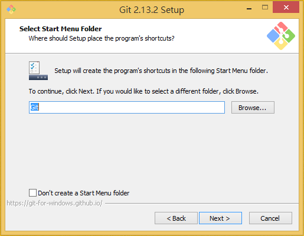
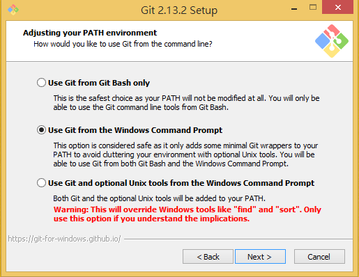
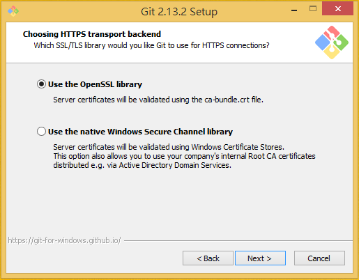
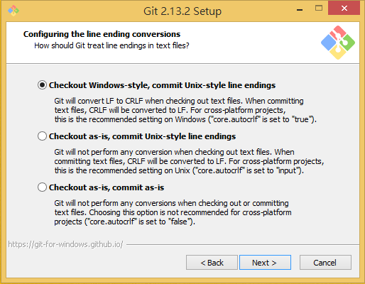
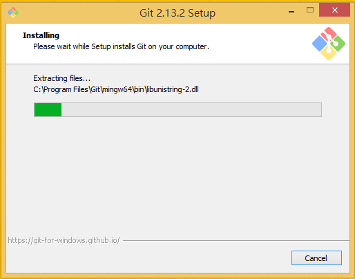
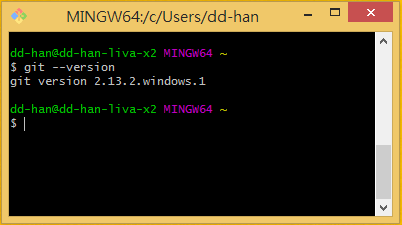

# git-init-window

本頁會詳細說明 git for Windows 工具包的安裝流程。點擊 git for Windows 安裝包後，會出現以下畫面，請點擊 `next` 繼續。



選擇 git for Windows 工具包安裝目錄，建議維持預設值即可。



選擇要安裝的工具包套件，建議維持預設值即可。



選擇安裝後要在開始選單所顯示資料夾名稱，建議維持預設值即可。



這裡提示是否為你在 `path` 路徑中加入 git 的執行檔，共有三種模式。強烈建議維持預設值即可。



選擇 git remote server 憑證的處理方式，建議維持預設值即可。



選擇斷句字元格式，建議維持預設值即可。



選擇要使用哪種終端機程式，建議維持預設值即可。


等待安裝完成。



預設會勾選第一個選項，按下 `finsish` 後即會開啟終端機視窗。開啟終端機之程式會是上兩步驟所選取的那組。


開啟終端機之後，請嘗試輸入以下指令：
```
git --version
```
應該會看到如下畫面，如果有即表示安裝順利成功。



如果終端機畫面沒有自動開啟，請打開開始功能表找到 `Git` 資料夾，點選以執行 `Git Bash`。


***

## 下一頁
- [回目錄](../SUMMARY.md)
- [返回 git init](../git-init/index.md)