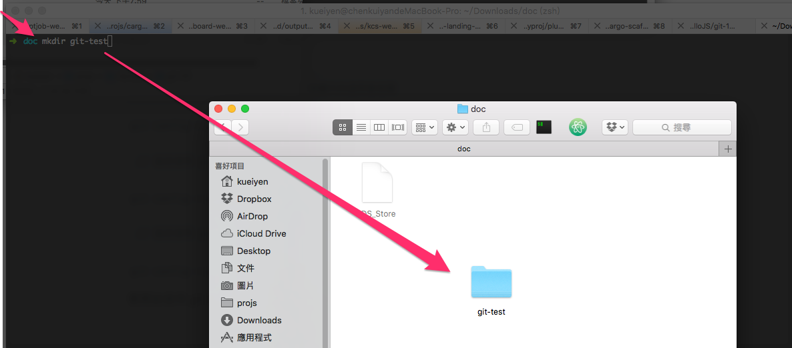
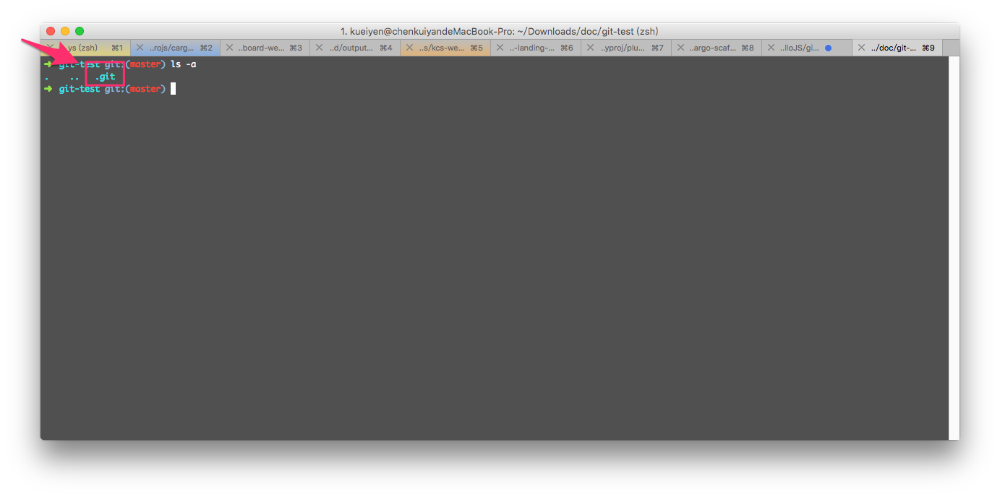

# git-init

## 目錄
- [回目錄](../SUMMARY.md)

***

## 前置準備 - 安裝 git

### Windows
- git for windows：[https://git-for-windows.github.io/](https://git-for-windows.github.io/)
- [安裝說明](../git-init-windows/index.md)

### Mac
- git osx installer：[http://sourceforge.net/projects/git-osx-installer/](http://sourceforge.net/projects/git-osx-installer/)

### Linux
- Fedora

// 於終端機貼上以下指令
```
yum install git-core
```

- Debian based(Ubuntu)

// 於終端機貼上以下指令
```
apt-get install git
```

## git 設定初始化

以下指令會`全域地`設定你在 git 中顯示的使用者名稱以及 Email，同時也會讓 git 幫輸出的訊息上色。請依序複製並把以下三行指令貼到終端機中。

// 設定使用 git commit/git log 時顯示的使用者名稱
```
git config --global user.name "你的名字"
```

// 設定使用 git commit/git log 時顯示的信箱
```
git config --global user.email "你的信箱"
```


*** 

## 使用 git init

首先，請先在你喜歡的地方（路徑中不能含有中文名稱）建立一個空的資料夾，命名為 `git-test`。



#### Mac/Ubuntu 使用者打開終端機後輸入以下指令：

// 切換至家目錄
```
cd ~
```

// 建立 `git-test` 資料夾
```
mkdir git-test
```

// 切換至剛建立好的資料夾
```
cd git-test
```

// 建立 git repository
```
git init
```

#### Windows 使用者打開終端機後輸入以下指令：

// 切換至根目錄
```
cd C:
```

// 建立 `git-test` 資料夾
```
mkdir git-test
```

// 切換至剛建立好的資料夾
```
cd git-test
```

// 建立 git repository
```
git init
```

完成之後會出現如下畫面，表示 git repository 已經在 `git-test` 資料夾初始化成功，我們可以開始新增檔案。


## 查看 git repository 

輸入以下指令，可以查看 `git-test` 資料夾中 git repository 的組成。

// Windows 使用者
```
dir /a
```

// Mac/Ubuntu 使用者
```
ls -a
```



## git repository 具體到底是什麼？
- 一個隱藏資料夾，叫做 `.git`
- 存有該資料夾所有的檔案變動紀錄與變動訊息
- 其他 git 需要的 metadata
- 沒事不要去動 `.git`

## 如何取得一個 git repository
- 使用 `git init` 產生
- 使用 `git clone` 由遠端取得已經存在的 repository 並複製回本機端

## 小結
- 學會使用指令切換資料夾
- 學會使用 `git init` 指令建立本機端的 git 儲存庫
- 了解 git 儲存庫具體來說是一個存有所有版本狀態、以及相關 metadata 的資料夾
- 了解可以使用 `git clone` 取得遠端的 git repository

***

## 下一頁
- [回目錄](../SUMMARY.md)
- [git 本機端操作](../git-local/index.md)