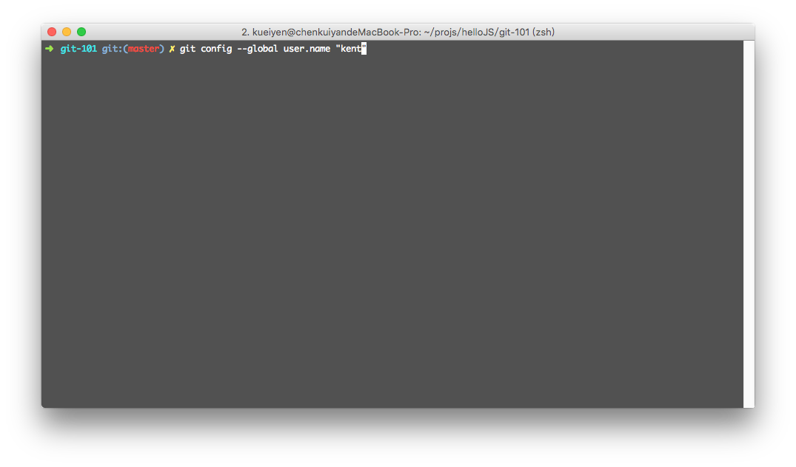

# git-init

## 目錄
- [回目錄](../SUMMARY.md)

***

## 安裝 git

### Windows
- git for windows：[https://git-for-windows.github.io/](https://git-for-windows.github.io/)

### Mac
- git osx installer：[http://sourceforge.net/projects/git-osx-installer/](http://sourceforge.net/projects/git-osx-installer/)

### Linux
- Fedora
// 於終端機貼上以下指令
```
yum install git-core
````

- Debian based(Ubuntu)
// 於終端機貼上以下指令
```
apt-get install git
```

## git 設定初始化

以下指令會`全域地`設定你在 git 中顯示的使用者名稱以及 Email，同時也會讓 git 幫輸出的訊息上色。請依序複製並把以下三行指令貼到終端機中。



// 設定使用 git commit/git log 時顯示的使用者名稱
```
git config --global user.name "你的名字"
```

// 設定使用 git commit/git log 時顯示的信箱
```
git config --global user.email "你的信箱"
```

// 設定使用 git status 時把輸出結果彩色劃
```
git config --global color.ui auto
```

要開始使用 git 基本上只需要這些設定，[git config 技巧](../git-conifg/index.md) 章節中會在介紹其他常用的設定選項。

## 下一頁
- [回目錄](../SUMMARY.md)
- [git clone](../git-clone/index.md)