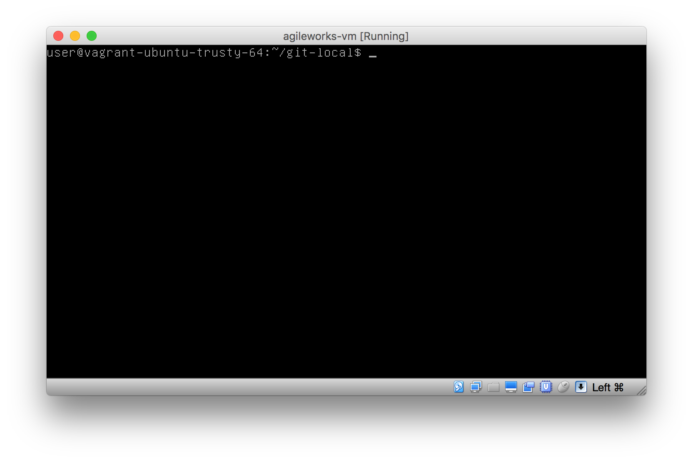
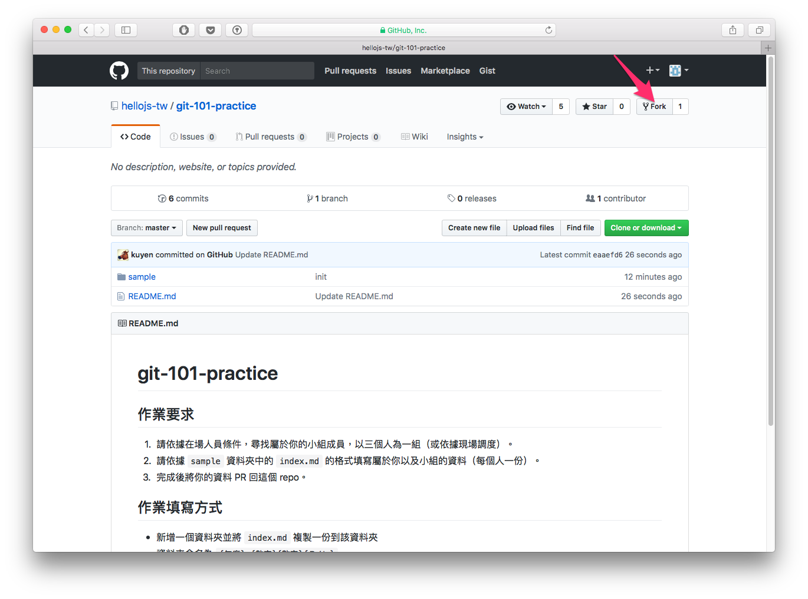
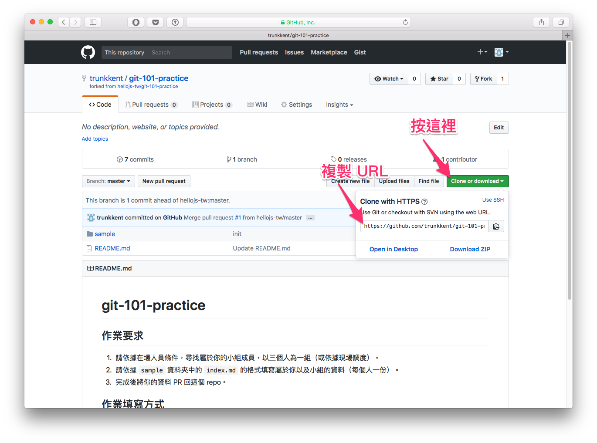
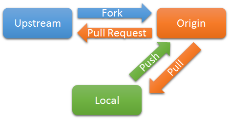
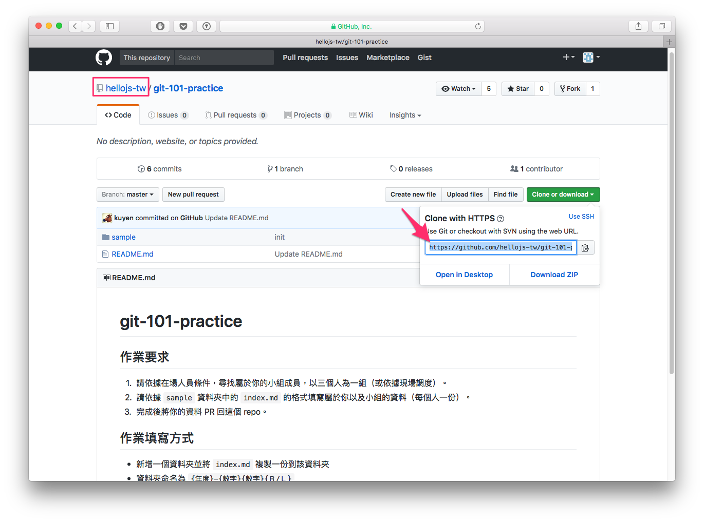
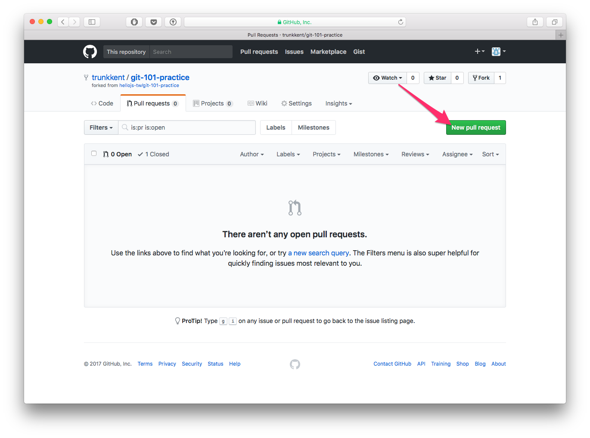
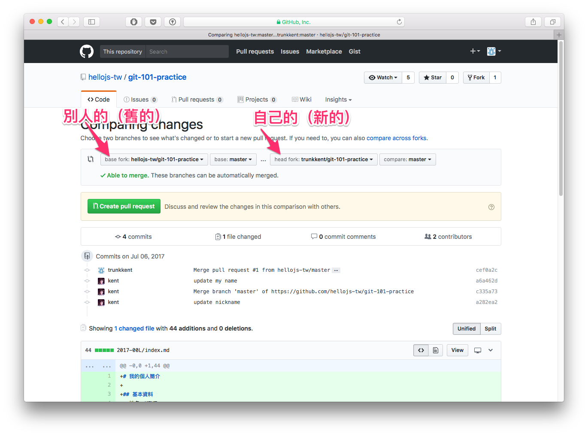
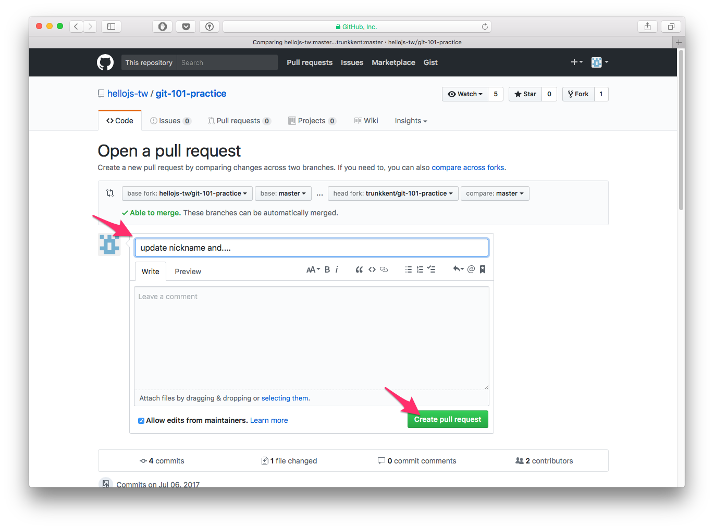

# git 多人協作

## 目錄
- [回目錄](../SUMMARY.md)


## git 工作流程


```
取自 https://www.git-tower.com/learn/git/ebook/en/command-line/remote-repositories/introduction
```

## 常用 linux 指令清單

***

```
// 清除螢幕
{ctrl} + {l}

// 查看當下資料夾內容
ls 

// 顯示某個檔案內容
cat {fileName}

// 建立資料夾
mkdir {folderName}

// 建立文字檔案
touch {fileName}

// 編輯文字檔案
vim {fileName}

// 刪除檔案
rm {fileName}

// 複製檔案到某處
cp {sourcc} {target}
```

***

## 常用 git 指令清單
```
// 設定使用 git commit/git log 時顯示的使用者名稱
git config --global user.name "你的名字"

// 設定使用 git commit/git log 時顯示的信箱
git config --global user.email "你的信箱"

// 建立本機 git repository
git init

// 新增檔案到 git 
git add {fileName}

// 新增全部檔案到 git
git add .

// 提交變更
git commit 

// 快速提交變更
git commit -m "訊息"

// 快速提交變更且選取全部檔案
git commit -m "訊息" --all

// 修改上一次的 commit 訊息
git commit --amend

// 顯示當下 git repository 狀態
git status

// 顯示變更歷史訊息
git log

// 顯示變更歷史訊息以及變更內容
git log -p 
git log -p --word-diff

// 顯示最後一個 commit 的歷史訊息與變更內容
git show

// 比對上次 commit 跟現在的工作目錄差異
git diff

// 比對某個 commit 跟現在的工作目錄差異
git diff {commit}

// 比對某兩次的變更內容
git diff {commit1} {commit2}

// 取消最近一次的變更
git checkout .

// 切換至某個分支
git checkout {remoteName} {branchName}

// 建立新分支
git checkout -b {branchName}

// 還原工作目錄至上一次 commit 之狀態
git reset 

// 還原工作目錄至某次 commit 之狀態，但是保留目前變更
git reset {commit}

// 還原工作目錄至某次 commit 之狀態，放棄目前變更
git reset {commit} --hard

// 暫存目前工作目錄狀態
git stash

// 檢視目前已經暫存的工作目錄狀態佇列
git stash list

// 套用某次的暫存變更
git stash apply {stash{x}}

// 取出上一次暫存的工作目錄狀態
git stash pop

// 清除已經暫存的工作目錄狀態佇列
git stash clear

// 合併兩個分支
git merge {branch1} {branch2}
```

***

## 常用 vim 指令
```
// 進入編輯模式
{i} key

// 離開編輯模式
{esc} key

// 離開編輯器
:q

// 儲存變更並離開編輯器
:wq
```

***

## git 多人協作常用指令
``` 
// 取得遠端 repository
git clone {URL}

// 取得遠端 repository 並在本地端改名
git clone {URL} {newName}

// 取得遠端 repository 狀態
git fetch

// 取得對應的遠端 branch 狀態並且合併到本地(git merge)
git pull

// 取得指定的遠端 branch 並且合併到本地
git pull {remoteName} {branchName}

// 把已經 commit 的歷史狀態 push 到已經對應遠端
git push

// 把已經 commit 的狀態 push 到遠端的某個 repository
git push {remoteName} {branchName}

// 查看遠端名稱
git remote

// 查看遠端名稱與路徑
git remote -v

// 加入遠端路徑
git remote add {remoteName} {url}

// 加入遠端路徑
git remote remove {remoteName} {url}

// 顯示目前 branch 對應的遠端路徑
git branch -r 

// 設定跟隨遠端的某個 branch，以便使用 git fetch/pull/push
git branch --set-upstream {remoteName}/{branchName}
```

***

## git 多人協作操作流程

課程內容使用 HelloJS 專用 VM 進行操作，以下按照順序列出課程依序會使用到的指令。




### fork 範例專案
使用瀏覽器開啟以下連結：
```
https://github.com/hellojs-tw/git-101-practice
```

然後點選箭頭處的 `fork`


複製你 fork 回來的專案 URL


回到終端機，輸入以下指令：
```
git clone {你的URL}

// e.g.
git clone https://github.com/trunkkent/git-101-practice.git
```

### 操作 fork 下來的 repository

開啟瀏覽器，輸入以下網址以開啟 VM 中的 C9：
```
http://localhost:9083
```

然後輸入以下指令：
```
// 操作 git push

ls

cd git-101-practice

git remote -v

mkdir 2017-00L

cp sample/index.md 2017-00L/index.md

{修改檔案...}

git status

git add .

git commit -m 'update my name'

git push

{輸入帳號密碼...}
```

### 當遠端 repo 更新時，把更新 pull 回你自己的 repo



再次使用瀏覽器開啟以下連結：
```
https://github.com/hellojs-tw/git-101-practice
```

複製遠端 repo 的 URL



回到 C9 輸入以下指令：
```
git remote -v

git remote add https://github.com/hellojs-tw/git-101-practice.git

{更新遠端...}

git pull upstream master

git log
```

### 如何發出 pull request


回到 C9 更新檔案，輸入以下指令：
```
{編輯檔案...}

git status

git commit -m 'update nickname' --all

git push
```

使用瀏覽器打開自己的 repo，例如：
```
https://github.com/trunkkent/git-101-practice
```

點選 `Pull request` 頁籤，再按下 `New pull request` 按鈕



仔細對照 `base` 以及 `compare` 欄位中的 repo 是否符合



輸入這次 pull request 的更新訊息，然後按下 `Create pull request`




