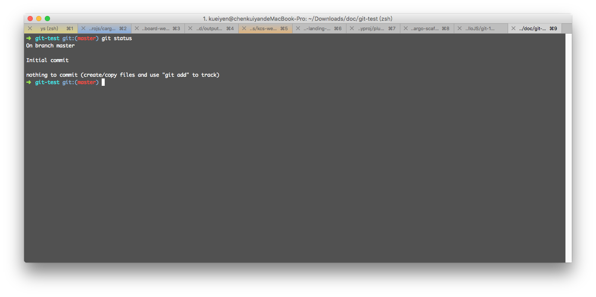
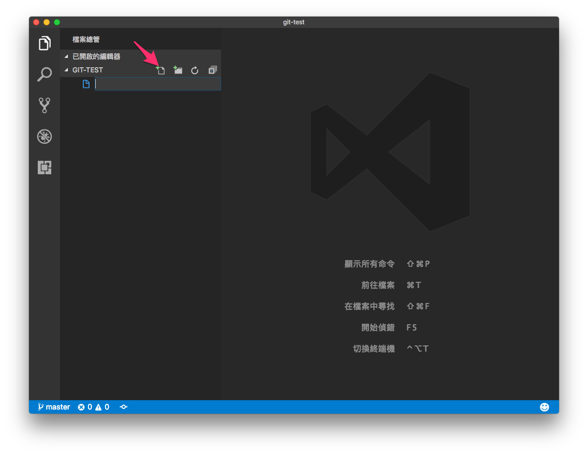
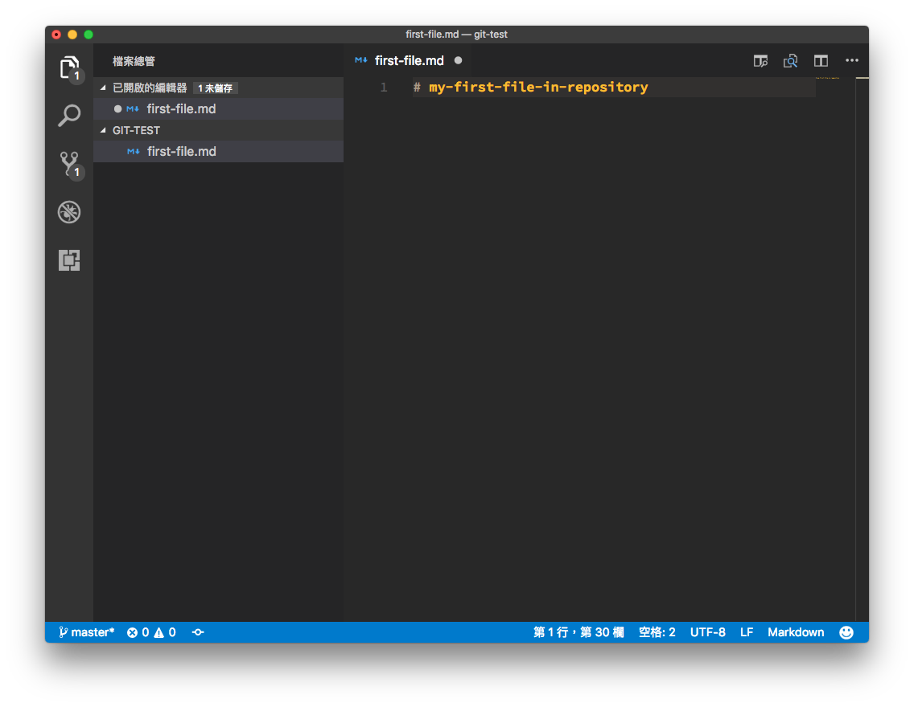
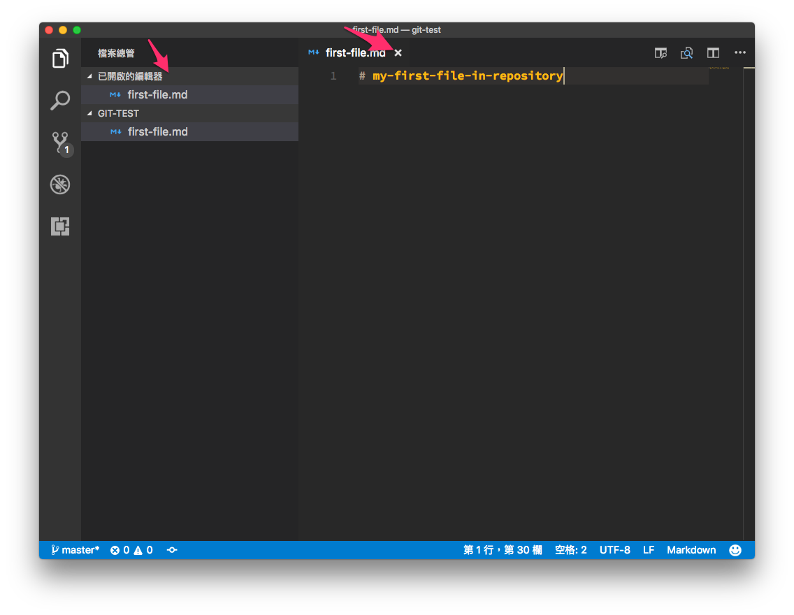
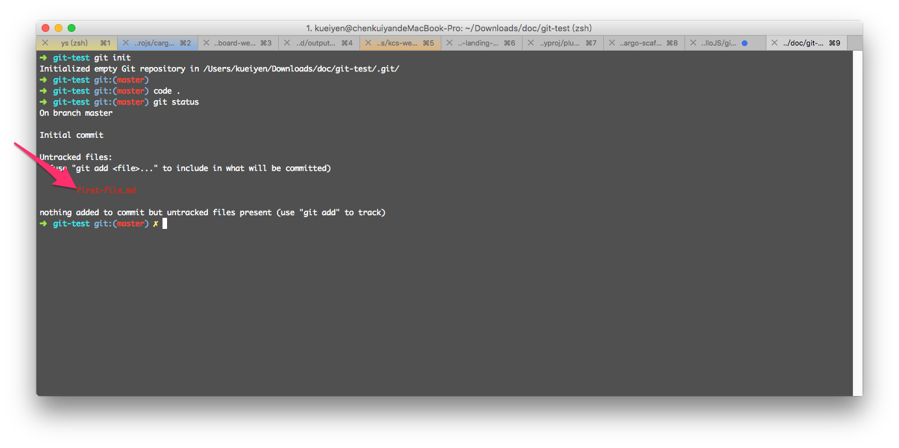

# git-status

## 目錄
- [回目錄](../SUMMARY.md)

***

在上一章節，你應該已經看到如下畫面，表示 git repository 已經初始化成功。


## 使用 git-status 檢視檔案狀態

回到終端機，__確保目前已經進入 `git-test` 資料夾後__，輸入以下指令：

```
git status
```

完成後會出現如下訊息，表示目前沒有任何東西可以進行 commit。



## 新增檔案到 repository

請使用 `VS Code` 開啟上一步驟所建立的 `git-test` 資料夾，並且新增一個檔案 `first-file.md`，然後輸入文字 `#my-first-file-in-repository`。





請確保有按下 `ctrl+s`(windwos) 或 `cmd+s`(mac) 儲存檔案；如果已經儲存，箭頭處的提示符號與訊息會消失。



## 再次使用 git-status 檢視檔案狀態

回到終端機，__確保目前已經進入 `git-test` 資料夾後__，輸入以下指令：

```
git status
```

完成後會出現如下訊息，箭頭處所顯示即為方才加入的檔案。



## 小結
- 學會如何使用 VS CODE 新增檔案
- 學會使用 `git status` 指令檢查 git repository 狀態

***

## 下一頁
- [回目錄](../SUMMARY.md)
- [git clone](../git-clone/index.md)