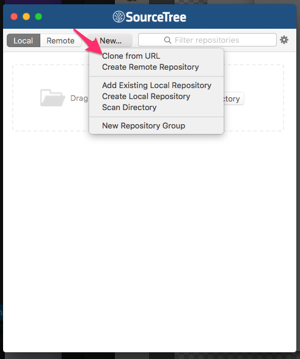

# SourceTree 使用

## 目錄
- [回目錄](../SUMMARY.md)

***

# SourceTree


## 軟體下載

https://www.sourcetreeapp.com/


## 註冊帳號

<https://www.sourcetreeapp.com/register/>


## 使用 SourceTree clone 專案

開啟 SourceTree，找到

- Windows 使用者找到
```
File -> New/Clone
2. 填入 Soruce URL
```



- Mac 使用者

```
1. New -> Clone from URL
2. 填入 Soruce URL
```


## 新增專案


## 查看提交紀錄


## 修改過檔案後的提交紀錄


## 修改提交


## 修改推送


## 編修衝突


***

## 下一頁
- [回目錄](../SUMMARY.md)